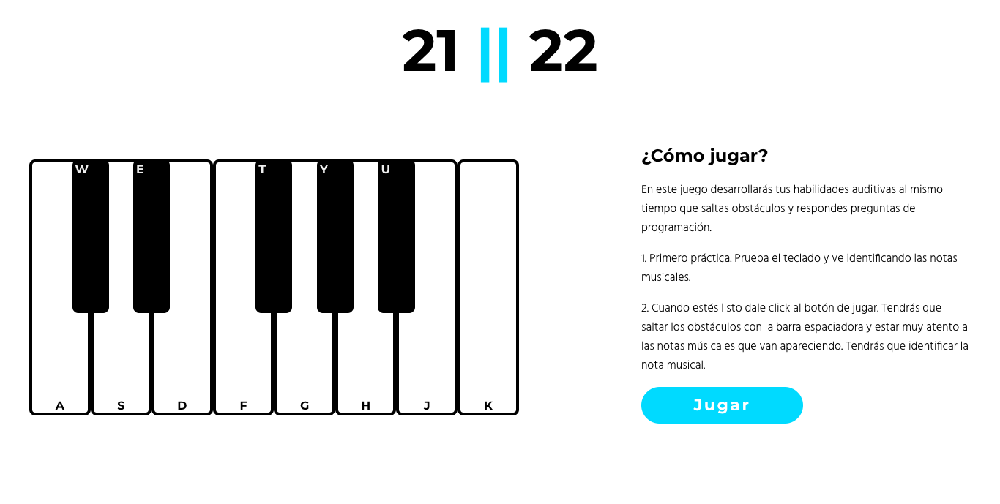
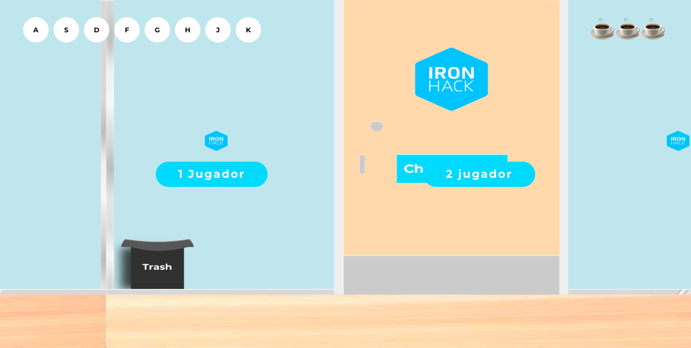
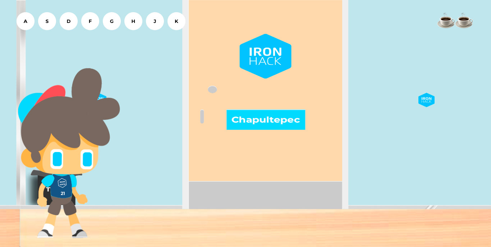
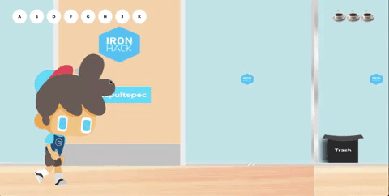

# 21 || 22

21 || 22 it's a game that seeks to improve ear skills by detecting musical notes. :musical_note:
You will have to jump over obstacles while listening to a musical note and choose the right one.

## The Game

#### Overview

###### Controls
Up <kbd>↑</kbd>
Right <kbd>→</kbd>

###### Musical Notes
:musical_score: C :point_right: <kbd>A</kbd>
:musical_score: D :point_right: <kbd>S</kbd>
:musical_score: E :point_right: <kbd>D</kbd>
:musical_score: F :point_right: <kbd>F</kbd>
:musical_score: G :point_right: <kbd>G</kbd>
:musical_score: A :point_right: <kbd>H</kbd>
:musical_score: B :point_right: <kbd>J</kbd>
:musical_score: C :point_right: <kbd>K</kbd>

**First**: You need to train your ear. Play the notes on the piano. :musical_keyboard:

**Second**: Choose a game mode. Single player or Multiplayer. :video_game:

**Third**: You must be alert to the musical notes and obstacles. If you hear the music note, press the key, and if you see the obstacle, JUMP! :runner:

## Let's play!
[21-22](https://21veintidos.com/)

## Contributing
* Fork this repo.
* Clone this repo.

Pull requests are welcome. For major changes, please open an issue first to discuss what you would like to change.